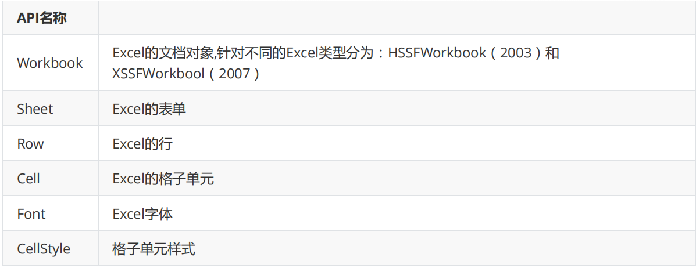

## 概述
Java中用来操作Excl的方式：`JXL`和`POI`
JXL只能对Excel进行操作,属于比较老的框架，它只支持到Excel 95-2000的版本。现在已经停止更新和维护
POI是apache的项目,可对微软的Word,Excel,Ppt进行操作,包括offiffiffice2003和2007,Excl2003和2007。poi现在
一直有更新。所以现在主流使用POI。

## POI的概述
Apache POI是Apache软件基金会的开源项目，由Java编写的免费开源的跨平台的 Java API，Apache POI提供API给Java语言操作Microsoft Offiffiffice的功能。

## POI的应用场景
1. 数据报表生成
2. 数据备份
3. 数据批量上传

## POI的环境搭建
maven的pom.xml
``` xml
<dependencies>
  <dependency>
      <groupId>org.apache.poi</groupId>
      <artifactId>poi</artifactId>
      <version>4.0.1</version>
  </dependency>
  <dependency>
      <groupId>org.apache.poi</groupId>
      <artifactId>poi-ooxml</artifactId>
      <version>4.0.1</version>
  </dependency>
  <dependency>
      <groupId>org.apache.poi</groupId>
      <artifactId>poi-ooxml-schemas</artifactId>
      <version>4.0.1</version>
  </dependency>
</dependencies>
```

## POI结构说明
**HSSF****提供读写****Microsoft Excel XLS****格式档案的功能。**

**XSSF****提供读写****Microsoft Excel OOXML XLSX****格式档案的功能。**

HWPF提供读写Microsoft Word DOC格式档案的功能。

HSLF提供读写Microsoft PowerPoint格式档案的功能。

HDGF提供读Microsoft Visio格式档案的功能。

HPBF提供读Microsoft Publisher格式档案的功能。

HSMF提供读Microsoft Outlook格式档案的功能
## API介绍


## 基本操作

创建excel
``` Java
public class PoiTest01 {
    //测试创建excel文件
    public static void main(String[] args) throws Exception {
        //1.创建workbook工作簿
        Workbook wb = new XSSFWorkbook();
        //2.创建表单Sheet
        Sheet sheet = wb.createSheet("test");
        //3.文件流
        FileOutputStream fos = new FileOutputStream("E:\\test.xlsx");
        //4.写入文件
        wb.write(fos);
        fos.close();
   }
}
```

创建单元格
``` Java
//测试创建单元格
    public static void main(String[] args) throws Exception {
        //1.创建workbook工作簿
        Workbook wb = new XSSFWorkbook();
        //2.创建表单Sheet
        Sheet sheet = wb.createSheet("test");
        //3.创建行对象，从0开始
        Row row = sheet.createRow(3);
        //4.创建单元格，从0开始
        Cell cell = row.createCell(0);
        //5.单元格写入数据
        cell.setCellValue("德源教育");
        //6.文件流
        FileOutputStream fos = new FileOutputStream("E:\\test.xlsx");
        //7.写入文件
         wb.write(fos);
        fos.close();
   }
```

## 设置格式
``` Java
//创建单元格样式对象
        CellStyle cellStyle = wb.createCellStyle();
        //设置边框
        cellStyle.setBorderBottom(BorderStyle.DASH_DOT);//下边框
        cellStyle.setBorderTop(BorderStyle.HAIR);//上边框
        //设置字体
        Font font = wb.createFont();//创建字体对象
        font.setFontName("华文行楷");//设置字体
        font.setFontHeightInPoints((short)28);//设置字号
        cellStyle.setFont(font);
        //设置宽高
        sheet.setColumnWidth(0, 31 * 256);//设置第一列的宽度是31个字符宽度
        row.setHeightInPoints(50);//设置行的高度是50个点
        //设置居中显示
        cellStyle.setAlignment(HorizontalAlignment.CENTER);//水平居中
        cellStyle.setVerticalAlignment(VerticalAlignment.CENTER);//垂直居中
        //设置单元格样式
        cell.setCellStyle(cellStyle);
        //合并单元格
        CellRangeAddress  region =new CellRangeAddress(0, 3, 0, 2);
        sheet.addMergedRegion(region);
```

**绘制图形**

``` Java
//绘制图形
    public static void main(String[] args) throws Exception {
        //1.创建workbook工作簿
        Workbook wb = new XSSFWorkbook();
        //2.创建表单Sheet
        Sheet sheet = wb.createSheet("test");
        //读取图片流
        FileInputStream stream=new FileInputStream("e:\\logo.jpg");
        byte[] bytes= IOUtils.toByteArray(stream);
        //读取图片到二进制数组
        stream.read(bytes);
        //向Excel添加一张图片,并返回该图片在Excel中的图片集合中的下标
        int pictureIdx = wb.addPicture(bytes,Workbook.PICTURE_TYPE_JPEG);
        //绘图工具类
        CreationHelper helper = wb.getCreationHelper();
         //创建一个绘图对象
        Drawing<?> patriarch = sheet.createDrawingPatriarch();
        //创建锚点,设置图片坐标
        ClientAnchor anchor = helper.createClientAnchor();
        anchor.setCol1(0);//从0开始
        anchor.setRow1(0);//从0开始
        //创建图片
        Picture picture = patriarch.createPicture(anchor, pictureIdx);
        picture.resize();
        //6.文件流
        FileOutputStream fos = new FileOutputStream("E:\\test.xlsx");
        //7.写入文件
        wb.write(fos);
        fos.close();
   }
```

加载Excel
``` Java
public class PoiTest06 {
    //单元格样式
    public static void main(String[] args) throws Exception {
        //1.创建workbook工作簿
        Workbook wb = new XSSFWorkbook("E:\\demo.xlsx");
        //2.获取sheet 从0开始
        Sheet sheet = wb.getSheetAt(0);
        int totalRowNum = sheet.getLastRowNum();
        Row row = null;
        Cell cell = null;
        //循环所有行
        for (int rowNum = 3; rowNum <sheet.getLastRowNum(); rowNum++) {
            row = sheet.getRow(rowNum);
            StringBuilder sb = new StringBuilder();
            //循环每行中的所有单元格
            for(int cellNum = 2; cellNum < row.getLastCellNum();cellNum++) {
                cell = row.getCell(cellNum);
                sb.append(getValue(cell)).append("-");
           }
            System.out.println(sb.toString());
       }
   }
    //获取数据
    private static Object getValue(Cell cell) {
        Object value = null;
        switch (cell.getCellType()) {
            case STRING: //字符串类型
                value = cell.getStringCellValue();
                break;
                case BOOLEAN: //boolean类型
                value = cell.getBooleanCellValue();
                break;
            case NUMERIC: //数字类型（包含日期和普通数字）
                if(DateUtil.isCellDateFormatted(cell)) {
                    value = cell.getDateCellValue();
               }else{
                    value = cell.getNumericCellValue();
               }
                break;
            case FORMULA: //公式类型
                value = cell.getCellFormula();
                break;
            default:
                break;
       }
        return value;
   }
}
```

## POI报表导入
maven的pom.xml
``` xml
<dependency>
            <groupId>commons-fileupload</groupId>
            <artifactId>commons-fileupload</artifactId>
            <version>1.3.1</version>
        </dependency>
        <dependency>
            <groupId>commons-io</groupId>
            <artifactId>commons-io</artifactId>
            <version>2.4</version>
        </dependency>
        <dependency>
            <groupId>org.apache.poi</groupId>
            <artifactId>poi</artifactId>
            <version>4.0.1</version>
        </dependency>
        <dependency>
            <groupId>org.apache.poi</groupId>
            <artifactId>poi-ooxml</artifactId>
            <version>4.0.1</version>
        </dependency>
        <dependency>
            <groupId>org.apache.poi</groupId>
            <artifactId>poi-ooxml-schemas</artifactId>
            <version>4.0.1</version>
        </dependency>
```
html

``` html
 <form action="user/fileupload" method="post" enctype="multipart/form-data">
       选择要上传的文件<input type="file" name="upload">
       <input type="submit" value="上传">
   </form>
```
spring的applicationContext.xml
``` xml
      <!--文件上传解析器-->
    <bean id="multipartResolver" class="org.springframework.web.multipart.commons.CommonsMultipartResolver">
          <property name="maxUploadSize" value="10485760"></property>
    </bean>
```
## 实现Excel上传
1. pojo
```
//objs数据位置和excel上传位置一致。
 public User(Object []objs,String companyId,String companyName) {
        //默认手机号excel读取为字符串会存在科学记数法问题，转化处理
        this.mobile = new DecimalFormat("#").format(objs[2]);
        this.username = objs[1].toString();
        this.createTime = new Date();
        this.timeOfEntry = (Date) objs[5];
        this.formOfEmployment = ((Double) objs[4]).intValue() ;
        this.workNumber = new DecimalFormat("#").format(objs[3]).toString();
        this.companyId = companyId;
        this.companyName = companyName;
   }
```
2. Controller 添加上传方法
``` Java
//批量导入数据
    @RequestMapping(value="/user/import", method = RequestMethod.POST)
    public Result importExcel(@RequestParam(name = "upload") MultipartFile attachment) 
throws Exception {
        //根据上传流信息创建工作簿
        Workbook workbook = WorkbookFactory.create(attachment.getInputStream());
        //获取第一个sheet
        Sheet sheet = workbook.getSheetAt(0);
        List<User> users = new ArrayList<>();
        //从第二行开始获取数据
        for (int rowNum = 1; rowNum <sheet.getLastRowNum(); rowNum++) {
            Row row = sheet.getRow(rowNum);
            Object objs[] = new Object[row.getLastCellNum()];
            //从第二列获取数据
            for(int cellNum = 1; cellNum < row.getLastCellNum();cellNum++) {
                Cell cell = row.getCell(cellNum);
                objs[cellNum] = getValue(cell);
           }
            //根据每一列构造用户对象
             User user = new User(objs,companyId,companyName);
            user.setDepartmentId(objs[objs.length-1].toString());
            users.add(user);
       }
        //第一个参数：用户列表，第二个参数：部门编码
        userService.save(users,objs[objs.length-1].toString());
        return Result.SUCCESS();
   }
```
3. Service 保存信息
``` Java
 @Transactional
    public void save(List<User> users) throws Exception {
        for (User user : users) {
            //配置密码
            user.setPassword(new Md5Hash("123456",user.getMobile(),3).toString());
            //配置id
            user.setId(idWorker.nextId()+"");
            //其他基本属性
            user.setInServiceStatus(1);
            user.setEnableState(1);
            user.setLevel("user");
            //获取部门信息
            Department dept =
departmentFeignClient.findById(user.getDepartmentId(),user.getCompanyId());
            if(dept != null) {
                user.setDepartmentId(dept.getId());
                user.setDepartmentName(dept.getName());
           }
            userDao.save(user);
            }
   }
```
## POI报表导出
1. Controller 添加导出方法
``` Java
@RequestMapping(value = "/export/{month}", method = RequestMethod.GET)
    public void export(@PathVariable(name = "month") String month) throws Exception {
        //1.构造数据
        List<EmployeeReportResult> list =
userCompanyPersonalService.findByReport(companyId,month+"%");
        //2.创建工作簿
        XSSFWorkbook workbook = new XSSFWorkbook();
        //3.构造sheet
        String[] titles = {"编号", "姓名", "手机","最高学历", "国家地区", "护照号", "籍贯", 
"生日", "属相","入职时间","离职类型","离职原因","离职时间"};
        Sheet sheet = workbook.createSheet();
         Row row = sheet.createRow(0);
        AtomicInteger headersAi = new AtomicInteger();
        for (String title : titles) {
            Cell cell = row.createCell(headersAi.getAndIncrement());
            cell.setCellValue(title);
       }
        AtomicInteger datasAi = new AtomicInteger(1);
        Cell cell = null;
        for (EmployeeReportResult report : list) {
            Row dataRow = sheet.createRow(datasAi.getAndIncrement());
            //编号
            cell = dataRow.createCell(0);
            cell.setCellValue(report.getUserId());
            //姓名
            cell = dataRow.createCell(1);
            cell.setCellValue(report.getUsername());
            //手机
            cell = dataRow.createCell(2);
            cell.setCellValue(report.getMobile());
            //最高学历
            cell = dataRow.createCell(3);
            cell.setCellValue(report.getTheHighestDegreeOfEducation());
            //国家地区
            cell = dataRow.createCell(4);
            cell.setCellValue(report.getNationalArea());
       }
        String fileName = URLEncoder.encode(month+"人员信息.xlsx", "UTF-8");
        response.setContentType("application/octet-stream");
        response.setHeader("content-disposition", "attachment;filename=" + new
String(fileName.getBytes("ISO8859-1")));
        response.setHeader("filename", fileName);
        workbook.write(response.getOutputStream());
   }
```

dao层实现
``` Java
 @Select(value = "select new 
com.ihrm.domain.employee.response.EmployeeReportResult(a,b) " +
            "FROM UserCompanyPersonal a LEFT JOIN EmployeeResignation b ON 
a.userId=b.userId )")
    List<EmployeeReportResult> findByReport(String companyId, String month);
```