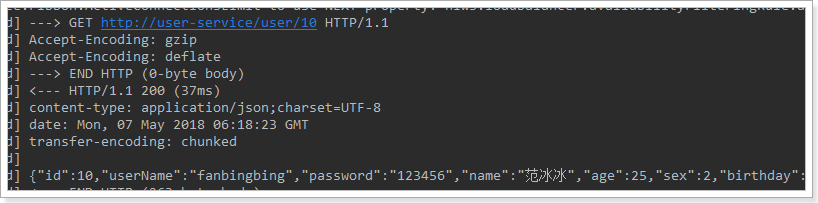

## 概述

对代码再次优化
Feign可以把Rest的请求进行隐藏，伪装成类似SpringMVC的Controller一样。你不用再自己拼接url，拼接参数等等操作
项目主页：https://github.com/OpenFeign/feign


## 依赖

``` xml
<dependency>
    <groupId>org.springframework.cloud</groupId>
    <artifactId>spring-cloud-starter-openfeign</artifactId>
</dependency>
```

## Feign的客户端
``` Java
package com.fengyuan.consumer.client;
@FeignClient("provider")  //引入要调用的微服务的名称
public interface UserFeignClient {

    @GetMapping("/user/{id}")
    User queryUserById(@PathVariable("id") Long id);
}
```
- 首先这是一个接口，Feign会通过动态代理，帮我们生成实现类。这点跟mybatis的mapper很像
- `@FeignClient`，声明这是一个Feign客户端，类似`@Mapper`注解。同时通过`value`属性指定服务名称
- 接口中的定义方法，完全采用SpringMVC的注解，Feign会根据注解帮我们生成URL，并访问获取结果

## @EnableFeignClients
启动类添加`@EnableFeignClients` // 开启Feign功能


## 集成
Feign中自动集成了Ribbon负载均衡,集成自动配置,集成hystrix熔断器

### 集成Hystix支持
配置中开启熔断功能
application.yml
``` yml
feign:
  hystrix:
    enabled: true # 开启Feign的熔断功能
```
实现编写的UserFeignClient，作为fallback的处理类;定义UserFeignClientFallback.java
``` Java
package cn.dy.feign.impl;
import cn.dy.entity.User;
import cn.dy.feign.UserFeignClient;
import org.springframework.stereotype.Component;
@Component
public class UserFeignClientFallback implements UserFeignClient {
    @Override
    public User queryById(Long id) {
        User user = new User();
        user.setUserName("服务器繁忙请稍后再试!!!");
        return user;
    }
}

```
修改UserFeginClient
``` Java
import cn.dy.entity.User;
import cn.dy.feign.impl.UserFeignClientFallback;
import org.springframework.cloud.openfeign.FeignClient;
import org.springframework.web.bind.annotation.GetMapping;
import org.springframework.web.bind.annotation.PathVariable;
@FeignClient( value = "provider",fallback = UserFeignClientFallback.class)    //引入要调用的微服务的名称
public interface UserFeignClient {

    @GetMapping("/user/{id}")
    User queryById(@PathVariable("id") Long id);
}
```

### 集成Ribbon负载均衡支持


## 2.5.请求压缩(了解)

Spring Cloud Feign 支持对请求和响应进行GZIP压缩，以减少通信过程中的性能损耗，有时候我们会在氢气数据比较大的时候会用到。通过下面的参数即可开启请求与响应的压缩功能：

```yaml
feign:
  compression:
    request:
      enabled: true # 开启请求压缩
    response:
      enabled: true # 开启响应压缩
```

同时，我们也可以对请求的数据类型，以及触发压缩的大小下限进行设置：

```yaml
feign:
  compression:
    request:
      enabled: true # 开启请求压缩
      mime-types: text/html,application/xml,application/json # 设置压缩的数据类型
      min-request-size: 2048 # 设置触发压缩的大小下限
```

注：上面的数据类型、压缩大小下限均为默认值。


## 2.6.日志级别(了解)

前面讲过，通过`logging.level.xx=debug`来设置日志级别。然而这个对Fegin客户端而言不会产生效果。因为`@FeignClient`注解修改的客户端在被代理时，都会创建一个新的Fegin.Logger实例。我们需要额外指定这个日志的级别才可以。

1）设置com.fengyuan包下的日志级别都为debug

```yaml
logging:
  level:
    com.fengyuan: debug
```

2）编写配置类，定义日志级别

```java
@Configuration
public class FeignConfig {
    @Bean
    Logger.Level feignLoggerLevel(){
        return Logger.Level.FULL;
    }
}
```

这里指定的Level级别是FULL，Feign支持4种级别：

​	

- NONE：不记录任何日志信息，这是默认值。
- BASIC：仅记录请求的方法，URL以及响应状态码和执行时间
- HEADERS：在BASIC的基础上，额外记录了请求和响应的头信息
- FULL：记录所有请求和响应的明细，包括头信息、请求体、元数据。

3）在FeignClient中指定配置类：

```java
@FeignClient(value = "user-service", fallback = UserFeignClientFallback.class, configuration = FeignConfig.class)
public interface UserFeignClient {
    @GetMapping("/user/{id}") 
    User queryUserById(@PathVariable("id") Long id);
}
```

4）重启项目，即可看到每次访问的日志：



