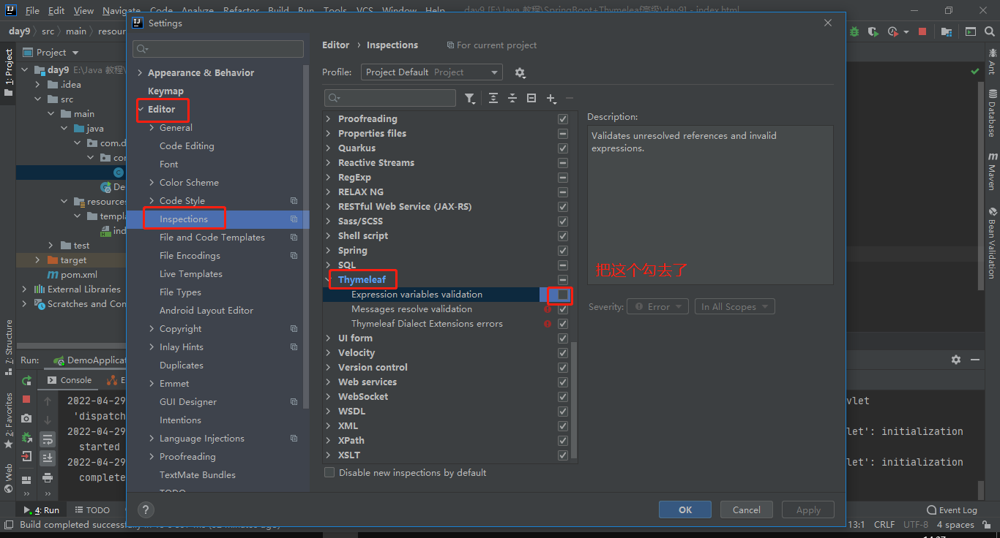

# 5.Thymeleaf 快速入门

SpringBoot并不推荐使用jsp，但是支持一些模板引擎技术：


以前大家用的比较多的是Freemarker，但是我们今天的主角是Thymeleaf！


## 5.1.为什么是Thymeleaf？

简单说， Thymeleaf 是一个跟 Velocity、FreeMarker 类似的模板引擎，它可以完全替代 JSP 。相较于其他的模板引擎，它有如下四个极吸引人的特点：

- 动静结合：Thymeleaf 在有网络和无网络的环境下皆可运行，即它可以让美工在浏览器查看页面的静态效果，也可以让程序员在服务器查看带数据的动态页面效果。这是由于它支持 html 原型，然后在 html 标签里增加额外的属性来达到模板+数据的展示方式。浏览器解释 html 时会忽略未定义的标签属性，所以 thymeleaf 的模板可以静态地运行；当有数据返回到页面时，Thymeleaf 标签会动态地替换掉静态内容，使页面动态显示。
- 开箱即用：它提供标准和spring标准两种方言，可以直接套用模板实现JSTL、 OGNL表达式效果，避免每天套模板、改jstl、改标签的困扰。同时开发人员也可以扩展和创建自定义的方言。
- 多方言支持：Thymeleaf 提供spring标准方言和一个与 SpringMVC 完美集成的可选模块，可以快速的实现表单绑定、属性编辑器、国际化等功能。
- 与SpringBoot完美整合，SpringBoot提供了Thymeleaf的默认配置，并且为Thymeleaf设置了视图解析器，我们可以像以前操作jsp一样来操作Thymeleaf。代码几乎没有任何区别，就是在模板语法上有区别。


接下来，我们就通过入门案例来体会Thymeleaf的魅力：


## 5.2.提供数据

编写一个controller方法，返回一些用户数据，放入模型中，将来在页面渲染

```java
@GetMapping("/all")
public String all(ModelMap model) {
    // 查询用户
    List<User> users = this.userService.queryAll();
    // 放入模型
    model.addAttribute("users", users);
    // 返回模板名称（就是classpath:/templates/目录下的html文件名）
    return "users";
}
```


## 5.3.引入启动器

直接引入启动器：

```xml
<dependency>
    <groupId>org.springframework.boot</groupId>
    <artifactId>spring-boot-starter-thymeleaf</artifactId>
</dependency>
```

SpringBoot会自动为Thymeleaf注册一个视图解析器：

 

与解析JSP的InternalViewResolver类似，Thymeleaf也会根据前缀和后缀来确定模板文件的位置：


- 默认前缀：`classpath:/templates/`
- 默认后缀：`.html`

所以如果我们返回视图：`users`，会指向到 `classpath:/templates/users.html`

一般我们无需进行修改，默认即可。

## 5.4.静态页面

根据上面的文档介绍，模板默认放在classpath下的templates文件夹，我们新建一个html文件放入其中：

 

编写html模板，渲染模型中的数据：

注意，把html 的名称空间，改成：`xmlns:th="http://www.thymeleaf.org"` 会有语法提示

```html
<!DOCTYPE html>
<html xmlns:th="http://www.thymeleaf.org">
<head>
    <meta charset="UTF-8">
    <title>首页</title>
    <style type="text/css">
        table {border-collapse: collapse; font-size: 14px; width: 80%; margin: auto}
        table, th, td {border: 1px solid darkslategray;padding: 10px}
    </style>
</head>
<body>
<div style="text-align: center">
    <span style="color: darkslategray; font-size: 30px">欢迎光临！</span>
    <hr/>
    <table class="list">
        <tr>
            <th>id</th>
            <th>姓名</th>
            <th>用户名</th>
            <th>年龄</th>
            <th>性别</th>
            <th>生日</th>
        </tr>
        <tr th:each="user : ${users}">
            <td th:text="${user.id}">1</td>
            <td th:text="${user.name}">张三</td>
            <td th:text="${user.userName}">zhangsan</td>
            <td th:text="${user.age}">20</td>
            <td th:text="${user.sex}">男</td>
            <td th:text="${user.birthday}">1980-02-30</td>
        </tr>
    </table>
</div>
</body>
</html>
```

我们看到这里使用了以下语法：

- `${}` ：这个类似与el表达式，但其实是ognl的语法，比el表达式更加强大
- `th-`指令：`th-`是利用了Html5中的自定义属性来实现的。如果不支持H5，可以用`data-th-`来代替
  - `th:each`：类似于`c:foreach`  遍历集合，但是语法更加简洁
  - `th:text`：声明标签中的文本
    - 例如`<td th-text='${user.id}'>1</td>`，如果user.id有值，会覆盖默认的1
    - 如果没有值，则会显示td中默认的1。这正是thymeleaf能够动静结合的原因，模板解析失败不影响页面的显示效果，因为会显示默认值！

## 5.5.测试

接下来，我们打开页面测试一下：


## 5.6.模板缓存

Thymeleaf会在第一次对模板解析之后进行缓存，极大的提高了并发处理能力。但是这给我们开发带来了不便，修改页面后并不会立刻看到效果，我们开发阶段可以关掉缓存使用：

```properties
# 开发阶段关闭thymeleaf的模板缓存
spring.thymeleaf.cache=false
```

**注意**：

	在Idea中，我们需要在修改页面后按快捷键：`Ctrl + Shift + F9` 对项目进行rebuild才可以。
	
	eclipse中没有测试过。

我们可以修改页面，测试一下。

Emp表:

 查询 全部     empno   ename    sal      hiredate    deptno

拔高题:  两表查询

dept表:  deptno   dname  local   

## idea配置thymeleaf语法报错
插件Plugins安装Thmeleaf


## SpringBoot集成thymeleaf开启热部署
``` yml
spring:
  thymeleaf:
    cache: false # 改成false启用热部署
```

## html解析
th:utext解析html标签

存入域中
``` Java
package com.doyens.controller;

import com.sun.deploy.net.HttpRequest;
import org.springframework.stereotype.Controller;
import org.springframework.web.bind.annotation.GetMapping;

import javax.servlet.http.HttpServletRequest;
import javax.servlet.http.HttpSession;
import java.util.Arrays;
import java.util.List;

/**
 * @author zrh
 * @date 2022/4/29
 * @apiNote
 */
@Controller
public class IndexController {
    @GetMapping("index")
    public String index(HttpServletRequest request, HttpSession session) {
        request.setAttribute("msg", "提示信息");
        List<String> list = Arrays.asList("谢霆锋", "刘德华", "王源");
        request.setAttribute("sList", list);
        request.setAttribute("age", 18);

        session.setAttribute("sname","刘德华");

        request.setAttribute("green","<span style=color:green>test</span>");

        return "index";
    }

}

```
html页面
``` html
<!DOCTYPE html >
<html lang="zh-CN" xmlns="http://www.w3.org/1999/xhtml" xmlns:th="http://www.thymeleaf.org">
<head>
    <meta charset="UTF-8">
    <meta http-equiv="X-UA-Compatible" content="IE=edge">
    <meta name="viewport" content="width=device-width, initial-scale=1.0">
    <title>index</title>
</head>

<body>

<h2>样式解析1</h2>
<span th:text="${green}"></span>
<h2>样式解析2</h2>
<div>
    <span th:utext="${green}"></span>

</div>
</body>
</html>
```

