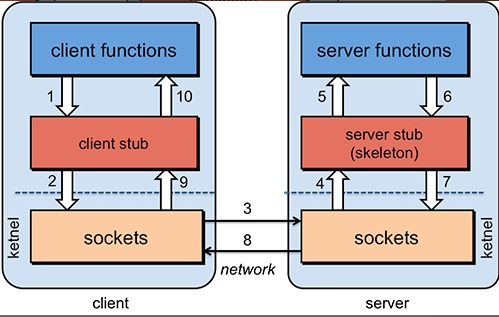

## 前言(RPC)
RPC【Remote Procedure Call】是指远程过程调用，是一种进程间通信方式
它允许程序调用另一个地址空间（通常是共享网络的另一台机器上）的过程或函数，而不用程序员显式编码这个远程调用的细节

RPC基本原理

RPC通信及序列化

## 概述
简介
Apache Dubbo (incubating) |ˈdʌbəʊ| 是一款高性能、轻量级的开源Java RPC框架，它提供了三大核心能力：面向接口的远程方法调用，智能容错和负载均衡，以及服务自动注册和发现
官网：http://dubbo.apache.org/
Dubbox 是一个分布式服务框架，其前身是阿里巴巴开源项目Dubbo ，被国内电商及互联网项目中使用，后期阿里巴巴停止了该项目的维护，当当网便在Dubbo基础上进行优化，并继续维护，为了与原有的Dubbo区分，故将其命名为Dubbox

## 核心
服务提供者（Provider）：服务提供方，服务提供者在启动时，向注册中心注册自己提供的服务。
服务消费者（Consumer）: 调用远程服务的服务消费方，服务消费者在启动时，向注册中心订阅自己所需的服务，服务消费者，从提供者地址列表中，基于软负载均衡算法，选一台提供者进行调用，如果调用失败，再选另一台调用。
注册中心（Registry）：注册中心返回服务提供者地址列表给消费者，如果有变更，注册中心将基于长连接推送变更数据给消费者
监控中心（Monitor）：服务消费者和提供者，在内存中累计调用次数和调用时间，定时每分钟发送一次统计数据到监控中心
## dubbo通信流程

调用关系说明
服务容器负责启动，加载，运行服务提供者。
服务提供者在启动时，向注册中心注册自己提供的服务。
服务消费者在启动时，向注册中心订阅自己所需的服务。
注册中心返回服务提供者地址列表给消费者，如果有变更，注册中心将基于长连接推送变更数据给消费者。
服务消费者，从提供者地址列表中，基于软负载均衡算法，选一台提供者进行调用，如果调用失败，再选另一台调用。
服务消费者和提供者，在内存中累计调用次数和调用时间，定时每分钟发送一次统计数据到监控中心。

## 注册中心Zookeeper

dubbo官方推荐使用 zookeeper 注册中心。
注册中心负责服务地址的注册与查找，相当于目录服务，服务提供者和消费者只在启动时与注册中心交互，注册中心不转发请求，压力较小。
Zookeeper 是 Apacahe Hadoop 的子项目，是一个树型的目录服务，支持变更推送，适合作为Dubbox 服务的注册中心，工业强度较高，可用于生产环境。